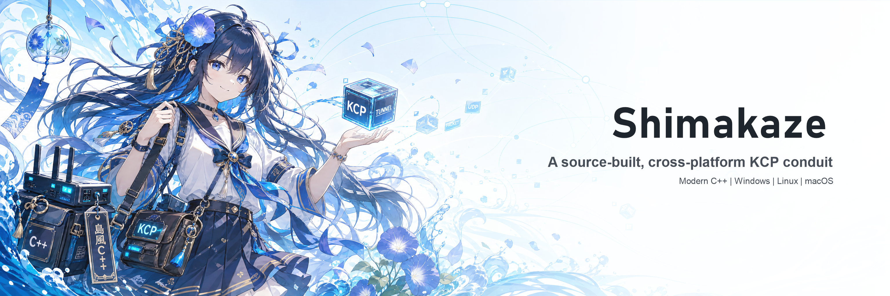

<div align="center">
  <p>
    
  </p>

  <p>
    <a href="../.github/workflows/shimakaze-build.yml"></a>
    
    
    
    
    
    
    
    
  </p>

  <p>
    <a href="#中文">中文</a> ·
    <a href="#english">English</a> ·
    <a href="#日本語">日本語</a> ·
    <a href="#deutsch">Deutsch</a> ·
    <a href="#italiano">Italiano</a> ·
    <a href="#francais">Français</a> ·
    <a href="#espanol">Español</a> ·
    <a href="#svenska">Svenska</a>
  </p>

</div>

## OpenWrt

GitHub Actions 中的 `shimakaze-linux-x64` 和 `shimakaze-linux-arm64` 使用 musl 构建为全静态 ELF，不依赖 OpenWrt 上不存在的 Ubuntu/glibc 动态加载器。下载后先解压 artifact 中的 `.tar.gz`，再按设备架构运行：

```sh
uname -m
# x86_64  -> shimakaze-linux-x64
# aarch64 -> shimakaze-linux-arm64

tar -xzf shimakaze-linux-arm64.tar.gz
cd shimakaze-linux-arm64
chmod 755 bin/client bin/server
./bin/client --version
```

必须使用 `./bin/client`（或安装到 `PATH` 后再使用 `client`）；当前目录默认不在 OpenWrt 的 `PATH` 中。现有发布物仅覆盖 x86_64 和 AArch64，ARMv7/MIPS 设备需要使用对应 target/subtarget 的 OpenWrt SDK 单独交叉编译。

The Linux artifacts are fully static musl executables for x86_64 and AArch64. Run them as `./bin/client`, not bare `client`; other OpenWrt architectures require a matching OpenWrt SDK build.

## 中文

**Shimakaze** 是一个用现代 C++ 包装 KCP 协议的 UDP 加速器，保留了对 KCP 源码目录的直接依赖，方便随时更新上游 KCP；Boost、Snappy、Crypto++ 均由 CMake 从源码拉取和构建。

### 功能

<table>
  <tr>
    <td width="260" valign="top">
      
    </td>
    <td valign="top">
      <ul>
        <li>client/server CLI 与 JSON 配置字段，面向常见 KCP 隧道工作流。</li>
        <li>KCP stream mode、mode presets、manual KCP 参数、ACK no delay、限速、socket buffer、DSCP、MTU、端口范围。</li>
        <li>smux v1/v2 多路复用、keepalive、closewait、frame size、stream buffer、smux receive buffer。</li>
        <li>Snappy framed stream 压缩，压缩层位于流式传输链路上。</li>
        <li>Reed-Solomon FEC，兼容 kcp-go FEC packet layout。</li>
        <li>隧道加密方法：<code>null</code>, <code>none</code>, <code>aes</code>, <code>aes-128</code>, <code>aes-192</code>, <code>aes-256</code>, <code>aes-128-gcm</code>, <code>salsa20</code>, <code>blowfish</code>, <code>twofish</code>, <code>cast5</code>, <code>3des</code>, <code>tea</code>, <code>xtea</code>, <code>xor</code>, <code>sm4</code>。</li>
        <li>QPP stream obfuscation。</li>
        <li><code>--conn</code> 多连接、round-robin 会话选择、<code>autoexpire</code> 与 <code>scavengettl</code>。</li>
        <li><code>--snmplog</code> / <code>--snmpperiod</code> CSV 指标日志，字段名对齐 kcp-go。</li>
        <li><code>--pprof</code> 轻量诊断端口 <code>:6060</code>，<code>/debug/vars</code> 输出 SNMP JSON。</li>
        <li>Linux/macOS 上支持 Unix domain socket 本地入口/目标；Windows 遇到 Unix socket 路径会给出明确错误。</li>
      </ul>
    </td>
  </tr>
</table>

### 构建

```powershell
cmake -S shimakaze -B shimakaze/build -G Ninja -DCMAKE_BUILD_TYPE=Release
cmake --build shimakaze/build --config Release
```

源码依赖：

| Dependency | Source | Version / Ref | Notes |
| --- | --- | --- | --- |
| KCP | `../kcp` first, fallback `https://github.com/skywind3000/kcp.git` | `master` | 直接源码依赖，便于更新 |
| Boost | `https://github.com/boostorg/boost.git` | `boost-1.91.0-1` | Asio / JSON / headers |
| Snappy | `https://github.com/google/snappy.git` | `1.2.2` | framed stream compression |
| Crypto++ | `https://github.com/weidai11/cryptopp.git` | `CRYPTOPP_8_9_0` | crypt suite and QPP primitives |

### 运行

Server:

```powershell
.\shimakaze\build\server.exe -l ":50612" -t "127.0.0.1:50712"
```

Client:

```powershell
.\shimakaze\build\client.exe -l ":50712" -r "127.0.0.1:50612" --conn 2
```

显式明文：

```powershell
.\shimakaze\build\client.exe --crypt none --nocomp
```

### 日志

```powershell
.\shimakaze\build\server.exe --log shimakaze.log --loglevel warn
```

支持 `trace`, `debug`, `info`, `warn`, `error`, `off`。`--quiet` 只压制 stream open/close 这类常规连接日志，不屏蔽 warning/error。密钥也可以通过 `SHIMAKAZE_KEY` 环境变量提供。

### GitHub Actions 多平台构建

workflow:

```text
.github/workflows/shimakaze-build.yml
```

构建产物：

- `shimakaze-windows-x64`
- `shimakaze-windows-arm64`
- `shimakaze-linux-x64`
- `shimakaze-linux-arm64`
- `shimakaze-macos-x64`
- `shimakaze-macos-arm64`

手动触发：

```powershell
.\shimakaze\scripts\build-all.ps1 -Watch
```

```sh
./shimakaze/scripts/build-all.sh "Shimakaze Build" --watch
```

### 平台说明

`--tcp` 依赖 Linux raw packet/tcpraw/特权注入能力，无法在 Windows/macOS 上无驱动、无系统依赖地等价实现。本项目保持 UDP transport 可用，并在请求 `--tcp` 时输出 warning。

## English

**Shimakaze** is a UDP accelerator that wraps the KCP protocol in modern C++. It keeps KCP as a direct source dependency so upstream KCP can be updated quickly; Boost, Snappy, and Crypto++ are fetched and built from source by CMake.

### Features

<table>
  <tr>
    <td width="260" valign="top">
      
    </td>
    <td valign="top">
      <ul>
        <li>Client/server CLI and JSON config fields for common KCP tunnel workflows.</li>
        <li>KCP stream mode, mode presets, manual KCP parameters, ACK no delay, pacing, socket buffers, DSCP, MTU, and port ranges.</li>
        <li>smux v1/v2 multiplexing with keepalive, closewait, frame size, stream buffer, and receive-buffer limits.</li>
        <li>Snappy framed stream compression placed in the stream transport path.</li>
        <li>Reed-Solomon FEC compatible with the kcp-go FEC packet layout.</li>
        <li>Tunnel crypt methods: <code>null</code>, <code>none</code>, <code>aes</code>, <code>aes-128</code>, <code>aes-192</code>, <code>aes-256</code>, <code>aes-128-gcm</code>, <code>salsa20</code>, <code>blowfish</code>, <code>twofish</code>, <code>cast5</code>, <code>3des</code>, <code>tea</code>, <code>xtea</code>, <code>xor</code>, <code>sm4</code>.</li>
        <li>QPP stream obfuscation.</li>
        <li><code>--conn</code> multi-connection mode, round-robin session selection, <code>autoexpire</code>, and <code>scavengettl</code>.</li>
        <li><code>--snmplog</code> / <code>--snmpperiod</code> CSV metrics with kcp-go-aligned field names.</li>
        <li><code>--pprof</code> lightweight diagnostics endpoint <code>:6060</code>; <code>/debug/vars</code> exports SNMP JSON.</li>
        <li>Unix domain sockets on Linux/macOS; Windows reports a clear error for Unix socket paths.</li>
      </ul>
    </td>
  </tr>
</table>

### Build

```sh
cmake -S shimakaze -B shimakaze/build -G Ninja -DCMAKE_BUILD_TYPE=Release
cmake --build shimakaze/build --config Release
```

Source dependencies:

| Dependency | Source | Version / Ref | Notes |
| --- | --- | --- | --- |
| KCP | `../kcp` first, fallback `https://github.com/skywind3000/kcp.git` | `master` | Direct source dependency for easy updates |
| Boost | `https://github.com/boostorg/boost.git` | `boost-1.91.0-1` | Asio / JSON / headers |
| Snappy | `https://github.com/google/snappy.git` | `1.2.2` | framed stream compression |
| Crypto++ | `https://github.com/weidai11/cryptopp.git` | `CRYPTOPP_8_9_0` | crypt suite and QPP primitives |

### Run

Server:

```sh
./shimakaze/build/server -l ":50612" -t "127.0.0.1:50712"
```

Client:

```sh
./shimakaze/build/client -l ":50712" -r "127.0.0.1:50612" --conn 2
```

Explicit plaintext:

```sh
./shimakaze/build/client --crypt none --nocomp
```

### Logs

```sh
./shimakaze/build/server --log shimakaze.log --loglevel warn
```

Supported levels: `trace`, `debug`, `info`, `warn`, `error`, `off`. `--quiet` only suppresses routine stream open/close logs. Secrets may also be provided through `SHIMAKAZE_KEY`.

### GitHub Actions Multi-Platform Build

workflow:

```text
.github/workflows/shimakaze-build.yml
```

Artifacts:

- `shimakaze-windows-x64`
- `shimakaze-windows-arm64`
- `shimakaze-linux-x64`
- `shimakaze-linux-arm64`
- `shimakaze-macos-x64`
- `shimakaze-macos-arm64`

Manual trigger:

```powershell
.\shimakaze\scripts\build-all.ps1 -Watch
```

```sh
./shimakaze/scripts/build-all.sh "Shimakaze Build" --watch
```

### Platform Note

`--tcp` requires Linux raw-packet/tcpraw privileges and cannot be implemented equivalently on Windows/macOS without drivers or system-level dependencies. Shimakaze keeps UDP transport available and warns when `--tcp` is requested.

## 日本語

**Shimakaze** は、現代的な C++ で KCP プロトコルを包み込む UDP アクセラレータです。KCP は直接のソース依存として保持し、上流 KCP をすばやく更新できます。Boost、Snappy、Crypto++ は CMake によりソースから取得してビルドします。

### 主な機能

<table>
  <tr>
    <td width="260" valign="top">
      
    </td>
    <td valign="top">
      <ul>
        <li>一般的な KCP トンネル運用に向けた client/server CLI と JSON 設定項目。</li>
        <li>KCP stream mode、プリセット、手動 KCP パラメータ、ACK no delay、レート制御、socket buffer、DSCP、MTU、ポート範囲。</li>
        <li>smux v1/v2 多重化、keepalive、closewait、frame size、stream buffer、receive buffer。</li>
        <li>ストリーム伝送経路上の Snappy framed stream 圧縮。</li>
        <li>kcp-go の FEC packet layout と互換の Reed-Solomon FEC。</li>
        <li>トンネル暗号方式：<code>null</code>, <code>none</code>, <code>aes</code>, <code>aes-128</code>, <code>aes-192</code>, <code>aes-256</code>, <code>aes-128-gcm</code>, <code>salsa20</code>, <code>blowfish</code>, <code>twofish</code>, <code>cast5</code>, <code>3des</code>, <code>tea</code>, <code>xtea</code>, <code>xor</code>, <code>sm4</code>。</li>
        <li>QPP stream obfuscation。</li>
        <li><code>--conn</code> 複数接続、round-robin セッション選択、<code>autoexpire</code>、<code>scavengettl</code>。</li>
        <li><code>--snmplog</code> / <code>--snmpperiod</code> CSV メトリクス、kcp-go と揃えたフィールド名。</li>
        <li><code>--pprof</code> 軽量診断ポート <code>:6060</code>、<code>/debug/vars</code> による SNMP JSON 出力。</li>
        <li>Linux/macOS の Unix domain socket 対応。Windows では Unix socket path に明確なエラーを返します。</li>
      </ul>
    </td>
  </tr>
</table>

### ビルド

```sh
cmake -S shimakaze -B shimakaze/build -G Ninja -DCMAKE_BUILD_TYPE=Release
cmake --build shimakaze/build --config Release
```

ソース依存:

| Dependency | Source | Version / Ref | Notes |
| --- | --- | --- | --- |
| KCP | `../kcp` first, fallback `https://github.com/skywind3000/kcp.git` | `master` | 更新しやすい直接ソース依存 |
| Boost | `https://github.com/boostorg/boost.git` | `boost-1.91.0-1` | Asio / JSON / headers |
| Snappy | `https://github.com/google/snappy.git` | `1.2.2` | framed stream compression |
| Crypto++ | `https://github.com/weidai11/cryptopp.git` | `CRYPTOPP_8_9_0` | crypt suite and QPP primitives |

### 実行

Server:

```sh
./shimakaze/build/server -l ":50612" -t "127.0.0.1:50712"
```

Client:

```sh
./shimakaze/build/client -l ":50712" -r "127.0.0.1:50612" --conn 2
```

明示的な平文:

```sh
./shimakaze/build/client --crypt none --nocomp
```

### ログ

```sh
./shimakaze/build/server --log shimakaze.log --loglevel warn
```

ログレベルは `trace`, `debug`, `info`, `warn`, `error`, `off` を指定できます。`--quiet` は通常の stream open/close ログだけを抑制します。秘密鍵は `SHIMAKAZE_KEY` 環境変数からも指定できます。

### GitHub Actions マルチプラットフォームビルド

workflow:

```text
.github/workflows/shimakaze-build.yml
```

成果物:

- `shimakaze-windows-x64`
- `shimakaze-windows-arm64`
- `shimakaze-linux-x64`
- `shimakaze-linux-arm64`
- `shimakaze-macos-x64`
- `shimakaze-macos-arm64`

手動トリガー:

```powershell
.\shimakaze\scripts\build-all.ps1 -Watch
```

```sh
./shimakaze/scripts/build-all.sh "Shimakaze Build" --watch
```

### プラットフォーム注記

`--tcp` は Linux raw packet / tcpraw / 特権注入機能に依存するため、Windows/macOS ではドライバやシステム依存なしに等価実装できません。Shimakaze は UDP transport を維持し、`--tcp` 要求時に warning を出します。

<h2 id="deutsch">Deutsch</h2>

**Shimakaze** ist ein UDP-Beschleuniger, der das KCP-Protokoll in modernem C++ kapselt. KCP bleibt als direkte Quellcode-Abhängigkeit eingebunden, damit Upstream-Änderungen schnell übernommen werden können; Boost, Snappy und Crypto++ werden von CMake aus dem Quellcode geholt und gebaut.

### Funktionen

<table>
  <tr>
    <td width="260" valign="top">
      
    </td>
    <td valign="top">
      <ul>
        <li>Client/server CLI und JSON-Konfiguration für typische KCP-Tunnel-Workflows.</li>
        <li>KCP stream mode, Profile, manuelle KCP-Parameter, ACK no delay, Pacing, Socket-Puffer, DSCP, MTU und Portbereiche.</li>
        <li>smux v1/v2 Multiplexing mit keepalive, closewait, frame size, stream buffer und receive-buffer limits.</li>
        <li>Snappy framed stream compression im Stream-Transportpfad.</li>
        <li>Reed-Solomon FEC kompatibel mit dem kcp-go FEC packet layout.</li>
        <li>Tunnel-Kryptomethoden: <code>null</code>, <code>none</code>, <code>aes</code>, <code>aes-128</code>, <code>aes-192</code>, <code>aes-256</code>, <code>aes-128-gcm</code>, <code>salsa20</code>, <code>blowfish</code>, <code>twofish</code>, <code>cast5</code>, <code>3des</code>, <code>tea</code>, <code>xtea</code>, <code>xor</code>, <code>sm4</code>.</li>
        <li>QPP stream obfuscation.</li>
        <li><code>--conn</code> Mehrfachverbindungen, round-robin Session-Auswahl, <code>autoexpire</code> und <code>scavengettl</code>.</li>
        <li><code>--snmplog</code> / <code>--snmpperiod</code> CSV-Metriken mit kcp-go-kompatiblen Feldnamen.</li>
        <li><code>--pprof</code> leichter Diagnose-Endpunkt <code>:6060</code>; <code>/debug/vars</code> liefert SNMP JSON.</li>
        <li>Unix domain sockets unter Linux/macOS; Windows meldet für Unix-Socket-Pfade einen klaren Fehler.</li>
      </ul>
    </td>
  </tr>
</table>

### Build

```sh
cmake -S shimakaze -B shimakaze/build -G Ninja -DCMAKE_BUILD_TYPE=Release
cmake --build shimakaze/build --config Release
```

Quellabhängigkeiten:

| Dependency | Source | Version / Ref | Notes |
| --- | --- | --- | --- |
| KCP | `../kcp` first, fallback `https://github.com/skywind3000/kcp.git` | `master` | Direkte Quellabhängigkeit für einfache Updates |
| Boost | `https://github.com/boostorg/boost.git` | `boost-1.91.0-1` | Asio / JSON / headers |
| Snappy | `https://github.com/google/snappy.git` | `1.2.2` | framed stream compression |
| Crypto++ | `https://github.com/weidai11/cryptopp.git` | `CRYPTOPP_8_9_0` | crypt suite and QPP primitives |

### Ausführen

Server:

```sh
./shimakaze/build/server -l ":50612" -t "127.0.0.1:50712"
```

Client:

```sh
./shimakaze/build/client -l ":50712" -r "127.0.0.1:50612" --conn 2
```

Expliziter Klartext:

```sh
./shimakaze/build/client --crypt none --nocomp
```

### Logs

```sh
./shimakaze/build/server --log shimakaze.log --loglevel warn
```

Unterstützte Level: `trace`, `debug`, `info`, `warn`, `error`, `off`. `--quiet` unterdrückt nur reguläre stream open/close Logs. Secrets können auch über `SHIMAKAZE_KEY` gesetzt werden.

### GitHub Actions Multi-Plattform-Build

workflow:

```text
.github/workflows/shimakaze-build.yml
```

Artefakte:

- `shimakaze-windows-x64`
- `shimakaze-windows-arm64`
- `shimakaze-linux-x64`
- `shimakaze-linux-arm64`
- `shimakaze-macos-x64`
- `shimakaze-macos-arm64`

Manueller Start:

```powershell
.\shimakaze\scripts\build-all.ps1 -Watch
```

```sh
./shimakaze/scripts/build-all.sh "Shimakaze Build" --watch
```

### Plattformhinweis

`--tcp` benötigt Linux raw packet/tcpraw-Berechtigungen und lässt sich unter Windows/macOS ohne Treiber oder Systemabhängigkeiten nicht gleichwertig umsetzen. Shimakaze bleibt bei UDP transport und warnt, wenn `--tcp` angefordert wird.

<h2 id="italiano">Italiano</h2>

**Shimakaze** è un acceleratore UDP che incapsula il protocollo KCP in C++ moderno. KCP resta una dipendenza diretta da sorgente, così gli aggiornamenti upstream possono essere integrati rapidamente; Boost, Snappy e Crypto++ vengono scaricati e compilati da CMake.

### Funzionalità

<table>
  <tr>
    <td width="260" valign="top">
      
    </td>
    <td valign="top">
      <ul>
        <li>CLI client/server e campi di configurazione JSON per workflow comuni di tunnel KCP.</li>
        <li>KCP stream mode, profili, parametri KCP manuali, ACK no delay, pacing, socket buffer, DSCP, MTU e intervalli di porte.</li>
        <li>Multiplexing smux v1/v2 con keepalive, closewait, frame size, stream buffer e limiti del receive buffer.</li>
        <li>Compressione Snappy framed stream nel percorso di trasporto stream.</li>
        <li>Reed-Solomon FEC compatibile con il layout dei pacchetti FEC di kcp-go.</li>
        <li>Metodi crittografici del tunnel: <code>null</code>, <code>none</code>, <code>aes</code>, <code>aes-128</code>, <code>aes-192</code>, <code>aes-256</code>, <code>aes-128-gcm</code>, <code>salsa20</code>, <code>blowfish</code>, <code>twofish</code>, <code>cast5</code>, <code>3des</code>, <code>tea</code>, <code>xtea</code>, <code>xor</code>, <code>sm4</code>.</li>
        <li>QPP stream obfuscation.</li>
        <li>Connessioni multiple con <code>--conn</code>, selezione sessione round-robin, <code>autoexpire</code> e <code>scavengettl</code>.</li>
        <li>Metriche CSV <code>--snmplog</code> / <code>--snmpperiod</code> con nomi campo allineati a kcp-go.</li>
        <li>Endpoint diagnostico leggero <code>:6060</code>; <code>/debug/vars</code> esporta SNMP JSON.</li>
        <li>Unix domain socket su Linux/macOS; su Windows i path Unix socket producono un errore esplicito.</li>
      </ul>
    </td>
  </tr>
</table>

### Build

```sh
cmake -S shimakaze -B shimakaze/build -G Ninja -DCMAKE_BUILD_TYPE=Release
cmake --build shimakaze/build --config Release
```

Dipendenze sorgente:

| Dependency | Source | Version / Ref | Notes |
| --- | --- | --- | --- |
| KCP | `../kcp` first, fallback `https://github.com/skywind3000/kcp.git` | `master` | Dipendenza diretta da sorgente per aggiornamenti rapidi |
| Boost | `https://github.com/boostorg/boost.git` | `boost-1.91.0-1` | Asio / JSON / headers |
| Snappy | `https://github.com/google/snappy.git` | `1.2.2` | framed stream compression |
| Crypto++ | `https://github.com/weidai11/cryptopp.git` | `CRYPTOPP_8_9_0` | crypt suite and QPP primitives |

### Esecuzione

Server:

```sh
./shimakaze/build/server -l ":50612" -t "127.0.0.1:50712"
```

Client:

```sh
./shimakaze/build/client -l ":50712" -r "127.0.0.1:50612" --conn 2
```

Testo in chiaro esplicito:

```sh
./shimakaze/build/client --crypt none --nocomp
```

### Log

```sh
./shimakaze/build/server --log shimakaze.log --loglevel warn
```

Livelli supportati: `trace`, `debug`, `info`, `warn`, `error`, `off`. `--quiet` sopprime solo i normali log di stream open/close. I segreti possono essere forniti anche tramite `SHIMAKAZE_KEY`.

### Build multipiattaforma GitHub Actions

workflow:

```text
.github/workflows/shimakaze-build.yml
```

Artefatti:

- `shimakaze-windows-x64`
- `shimakaze-windows-arm64`
- `shimakaze-linux-x64`
- `shimakaze-linux-arm64`
- `shimakaze-macos-x64`
- `shimakaze-macos-arm64`

Avvio manuale:

```powershell
.\shimakaze\scripts\build-all.ps1 -Watch
```

```sh
./shimakaze/scripts/build-all.sh "Shimakaze Build" --watch
```

### Nota piattaforma

`--tcp` richiede privilegi Linux raw packet/tcpraw e non può essere implementato in modo equivalente su Windows/macOS senza driver o dipendenze di sistema. Shimakaze mantiene il transport UDP e avvisa quando viene richiesto `--tcp`.

<h2 id="francais">Français</h2>

**Shimakaze** est un accélérateur UDP qui encapsule le protocole KCP en C++ moderne. KCP reste une dépendance source directe afin de faciliter les mises à jour amont ; Boost, Snappy et Crypto++ sont récupérés et compilés depuis leurs sources par CMake.

### Fonctionnalités

<table>
  <tr>
    <td width="260" valign="top">
      
    </td>
    <td valign="top">
      <ul>
        <li>CLI client/server et champs de configuration JSON pour les flux de travail courants de tunnels KCP.</li>
        <li>KCP stream mode, profils, paramètres KCP manuels, ACK no delay, pacing, tampons socket, DSCP, MTU et plages de ports.</li>
        <li>Multiplexage smux v1/v2 avec keepalive, closewait, frame size, stream buffer et limites de receive buffer.</li>
        <li>Compression Snappy framed stream dans le chemin de transport stream.</li>
        <li>Reed-Solomon FEC compatible avec le layout FEC de kcp-go.</li>
        <li>Méthodes de chiffrement du tunnel : <code>null</code>, <code>none</code>, <code>aes</code>, <code>aes-128</code>, <code>aes-192</code>, <code>aes-256</code>, <code>aes-128-gcm</code>, <code>salsa20</code>, <code>blowfish</code>, <code>twofish</code>, <code>cast5</code>, <code>3des</code>, <code>tea</code>, <code>xtea</code>, <code>xor</code>, <code>sm4</code>.</li>
        <li>QPP stream obfuscation.</li>
        <li>Connexions multiples <code>--conn</code>, sélection round-robin des sessions, <code>autoexpire</code> et <code>scavengettl</code>.</li>
        <li>Métriques CSV <code>--snmplog</code> / <code>--snmpperiod</code> avec noms de champs alignés sur kcp-go.</li>
        <li>Endpoint de diagnostic léger <code>:6060</code> ; <code>/debug/vars</code> exporte du SNMP JSON.</li>
        <li>Unix domain sockets sur Linux/macOS ; Windows signale clairement les chemins Unix socket.</li>
      </ul>
    </td>
  </tr>
</table>

### Build

```sh
cmake -S shimakaze -B shimakaze/build -G Ninja -DCMAKE_BUILD_TYPE=Release
cmake --build shimakaze/build --config Release
```

Dépendances source :

| Dependency | Source | Version / Ref | Notes |
| --- | --- | --- | --- |
| KCP | `../kcp` first, fallback `https://github.com/skywind3000/kcp.git` | `master` | Dépendance source directe pour faciliter les mises à jour |
| Boost | `https://github.com/boostorg/boost.git` | `boost-1.91.0-1` | Asio / JSON / headers |
| Snappy | `https://github.com/google/snappy.git` | `1.2.2` | framed stream compression |
| Crypto++ | `https://github.com/weidai11/cryptopp.git` | `CRYPTOPP_8_9_0` | crypt suite and QPP primitives |

### Exécution

Server:

```sh
./shimakaze/build/server -l ":50612" -t "127.0.0.1:50712"
```

Client:

```sh
./shimakaze/build/client -l ":50712" -r "127.0.0.1:50612" --conn 2
```

Texte clair explicite :

```sh
./shimakaze/build/client --crypt none --nocomp
```

### Logs

```sh
./shimakaze/build/server --log shimakaze.log --loglevel warn
```

Niveaux pris en charge : `trace`, `debug`, `info`, `warn`, `error`, `off`. `--quiet` ne masque que les logs ordinaires de stream open/close. Les secrets peuvent aussi être fournis par `SHIMAKAZE_KEY`.

### Build multiplateforme GitHub Actions

workflow:

```text
.github/workflows/shimakaze-build.yml
```

Artefacts :

- `shimakaze-windows-x64`
- `shimakaze-windows-arm64`
- `shimakaze-linux-x64`
- `shimakaze-linux-arm64`
- `shimakaze-macos-x64`
- `shimakaze-macos-arm64`

Déclenchement manuel :

```powershell
.\shimakaze\scripts\build-all.ps1 -Watch
```

```sh
./shimakaze/scripts/build-all.sh "Shimakaze Build" --watch
```

### Note plateforme

`--tcp` dépend de privilèges Linux raw packet/tcpraw et ne peut pas être reproduit à l'identique sur Windows/macOS sans pilotes ou dépendances système. Shimakaze conserve le transport UDP et émet un warning lorsque `--tcp` est demandé.

<h2 id="espanol">Español</h2>

**Shimakaze** es un acelerador UDP que envuelve el protocolo KCP con C++ moderno. KCP se mantiene como dependencia directa de código fuente para poder actualizarlo con rapidez; Boost, Snappy y Crypto++ se descargan y compilan desde sus fuentes mediante CMake.

### Funciones

<table>
  <tr>
    <td width="260" valign="top">
      
    </td>
    <td valign="top">
      <ul>
        <li>CLI client/server y campos de configuración JSON para flujos habituales de túneles KCP.</li>
        <li>KCP stream mode, perfiles, parámetros KCP manuales, ACK no delay, pacing, buffers de socket, DSCP, MTU y rangos de puertos.</li>
        <li>Multiplexación smux v1/v2 con keepalive, closewait, frame size, stream buffer y límites de receive buffer.</li>
        <li>Compresión Snappy framed stream en la ruta de transporte stream.</li>
        <li>Reed-Solomon FEC compatible con el layout FEC de kcp-go.</li>
        <li>Métodos criptográficos del túnel: <code>null</code>, <code>none</code>, <code>aes</code>, <code>aes-128</code>, <code>aes-192</code>, <code>aes-256</code>, <code>aes-128-gcm</code>, <code>salsa20</code>, <code>blowfish</code>, <code>twofish</code>, <code>cast5</code>, <code>3des</code>, <code>tea</code>, <code>xtea</code>, <code>xor</code>, <code>sm4</code>.</li>
        <li>QPP stream obfuscation.</li>
        <li>Múltiples conexiones con <code>--conn</code>, selección round-robin de sesiones, <code>autoexpire</code> y <code>scavengettl</code>.</li>
        <li>Métricas CSV <code>--snmplog</code> / <code>--snmpperiod</code> con nombres de campo alineados con kcp-go.</li>
        <li>Endpoint ligero de diagnóstico <code>:6060</code>; <code>/debug/vars</code> exporta SNMP JSON.</li>
        <li>Unix domain sockets en Linux/macOS; Windows devuelve un error claro para rutas Unix socket.</li>
      </ul>
    </td>
  </tr>
</table>

### Build

```sh
cmake -S shimakaze -B shimakaze/build -G Ninja -DCMAKE_BUILD_TYPE=Release
cmake --build shimakaze/build --config Release
```

Dependencias de código fuente:

| Dependency | Source | Version / Ref | Notes |
| --- | --- | --- | --- |
| KCP | `../kcp` first, fallback `https://github.com/skywind3000/kcp.git` | `master` | Dependencia directa de fuente para actualizaciones rápidas |
| Boost | `https://github.com/boostorg/boost.git` | `boost-1.91.0-1` | Asio / JSON / headers |
| Snappy | `https://github.com/google/snappy.git` | `1.2.2` | framed stream compression |
| Crypto++ | `https://github.com/weidai11/cryptopp.git` | `CRYPTOPP_8_9_0` | crypt suite and QPP primitives |

### Ejecución

Server:

```sh
./shimakaze/build/server -l ":50612" -t "127.0.0.1:50712"
```

Client:

```sh
./shimakaze/build/client -l ":50712" -r "127.0.0.1:50612" --conn 2
```

Texto claro explícito:

```sh
./shimakaze/build/client --crypt none --nocomp
```

### Logs

```sh
./shimakaze/build/server --log shimakaze.log --loglevel warn
```

Niveles admitidos: `trace`, `debug`, `info`, `warn`, `error`, `off`. `--quiet` solo silencia los logs rutinarios de stream open/close. Los secretos también pueden proporcionarse con `SHIMAKAZE_KEY`.

### Build multiplataforma de GitHub Actions

workflow:

```text
.github/workflows/shimakaze-build.yml
```

Artefactos:

- `shimakaze-windows-x64`
- `shimakaze-windows-arm64`
- `shimakaze-linux-x64`
- `shimakaze-linux-arm64`
- `shimakaze-macos-x64`
- `shimakaze-macos-arm64`

Activación manual:

```powershell
.\shimakaze\scripts\build-all.ps1 -Watch
```

```sh
./shimakaze/scripts/build-all.sh "Shimakaze Build" --watch
```

### Nota de plataforma

`--tcp` requiere privilegios Linux raw packet/tcpraw y no se puede implementar de forma equivalente en Windows/macOS sin drivers o dependencias del sistema. Shimakaze mantiene el transporte UDP y avisa cuando se solicita `--tcp`.

<h2 id="svenska">Svenska</h2>

**Shimakaze** är en UDP-accelerator som kapslar in KCP-protokollet i modern C++. KCP ligger kvar som ett direkt källkodsberoende så att uppströmsändringar kan tas in snabbt; Boost, Snappy och Crypto++ hämtas och byggs från källkod av CMake.

### Funktioner

<table>
  <tr>
    <td width="260" valign="top">
      
    </td>
    <td valign="top">
      <ul>
        <li>Client/server CLI och JSON-konfiguration för vanliga KCP-tunnelarbetsflöden.</li>
        <li>KCP stream mode, profiler, manuella KCP-parametrar, ACK no delay, pacing, socket buffers, DSCP, MTU och portintervall.</li>
        <li>smux v1/v2 multiplexing med keepalive, closewait, frame size, stream buffer och receive-buffer limits.</li>
        <li>Snappy framed stream compression i stream-transportvägen.</li>
        <li>Reed-Solomon FEC kompatibel med kcp-go FEC packet layout.</li>
        <li>Krypteringsmetoder för tunneln: <code>null</code>, <code>none</code>, <code>aes</code>, <code>aes-128</code>, <code>aes-192</code>, <code>aes-256</code>, <code>aes-128-gcm</code>, <code>salsa20</code>, <code>blowfish</code>, <code>twofish</code>, <code>cast5</code>, <code>3des</code>, <code>tea</code>, <code>xtea</code>, <code>xor</code>, <code>sm4</code>.</li>
        <li>QPP stream obfuscation.</li>
        <li>Flera anslutningar med <code>--conn</code>, round-robin session selection, <code>autoexpire</code> och <code>scavengettl</code>.</li>
        <li>CSV-mätvärden med <code>--snmplog</code> / <code>--snmpperiod</code> och fältnamn i linje med kcp-go.</li>
        <li>Lätt diagnostikendpoint <code>:6060</code>; <code>/debug/vars</code> exporterar SNMP JSON.</li>
        <li>Unix domain sockets på Linux/macOS; Windows ger ett tydligt fel för Unix socket paths.</li>
      </ul>
    </td>
  </tr>
</table>

### Build

```sh
cmake -S shimakaze -B shimakaze/build -G Ninja -DCMAKE_BUILD_TYPE=Release
cmake --build shimakaze/build --config Release
```

Källkodsberoenden:

| Dependency | Source | Version / Ref | Notes |
| --- | --- | --- | --- |
| KCP | `../kcp` first, fallback `https://github.com/skywind3000/kcp.git` | `master` | Direkt källkodsberoende för enkla uppdateringar |
| Boost | `https://github.com/boostorg/boost.git` | `boost-1.91.0-1` | Asio / JSON / headers |
| Snappy | `https://github.com/google/snappy.git` | `1.2.2` | framed stream compression |
| Crypto++ | `https://github.com/weidai11/cryptopp.git` | `CRYPTOPP_8_9_0` | crypt suite and QPP primitives |

### Körning

Server:

```sh
./shimakaze/build/server -l ":50612" -t "127.0.0.1:50712"
```

Client:

```sh
./shimakaze/build/client -l ":50712" -r "127.0.0.1:50612" --conn 2
```

Explicit klartext:

```sh
./shimakaze/build/client --crypt none --nocomp
```

### Loggar

```sh
./shimakaze/build/server --log shimakaze.log --loglevel warn
```

Stödda nivåer: `trace`, `debug`, `info`, `warn`, `error`, `off`. `--quiet` tystar endast vanliga stream open/close-loggar. Hemligheter kan också anges via `SHIMAKAZE_KEY`.

### GitHub Actions multiplattformsbygge

workflow:

```text
.github/workflows/shimakaze-build.yml
```

Artefakter:

- `shimakaze-windows-x64`
- `shimakaze-windows-arm64`
- `shimakaze-linux-x64`
- `shimakaze-linux-arm64`
- `shimakaze-macos-x64`
- `shimakaze-macos-arm64`

Manuell start:

```powershell
.\shimakaze\scripts\build-all.ps1 -Watch
```

```sh
./shimakaze/scripts/build-all.sh "Shimakaze Build" --watch
```

### Plattform

`--tcp` kräver Linux raw packet/tcpraw-privilegier och kan inte genomföras likvärdigt på Windows/macOS utan drivrutiner eller systemberoenden. Shimakaze behåller UDP transport och varnar när `--tcp` begärs.

## 版权与许可证 / Copyright And Licenses

Shimakaze 的原创源码以 `GPL-3.0-or-later` 发布，除非单个文件另有声明；许可证全文见 `LICENSE` 以及 `https://www.gnu.org/licenses/gpl-3.0.txt`。依赖项和协议参考仍遵循各自项目的许可证；发布源码或二进制时请一并保留相应 copyright、license 与 notice。

| Component | Reference | License |
| --- | --- | --- |
| Shimakaze original source | this repository | GPL-3.0-or-later |
| KCP | `https://github.com/skywind3000/kcp` | MIT License |
| Boost | `https://github.com/boostorg/boost` | Boost Software License 1.0 |
| Snappy | `https://github.com/google/snappy` | BSD-style license |
| Crypto++ | `https://github.com/weidai11/cryptopp` | Boost Software License 1.0 and public-domain components |
| smux behavior | `https://github.com/xtaci/smux` | MIT License |
| FEC packet layout | `https://github.com/xtaci/kcp-go` | MIT License |
| QPP | `https://github.com/xtaci/qpp` | GPL-3.0 |

This README and the generated visual assets in `assets/` are part of the Shimakaze project materials unless a later file-specific notice says otherwise.
